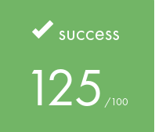
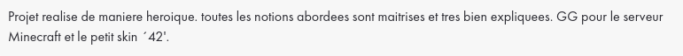

<h1 align="center">Inception</h1>

Douzième projet de [42](https://42.fr/), il est question de mettre en place une petite infrastructure avec plusieurs services grace à Docker.

Les concepts abordés sont :

- La dockérisation des services : NGINX, PHP, MariaDB, Radis, ProFTP et Minecraft.
- L'orchestrateur Docker Compose.

---

### Pré-requis :

- Une distribution Linux majeure à jour ou macOS Catalina ou plus.
- Docker et Docker compose installés

### Lancement du projet :

Pour lancer le projet, utiliser la commande suivante :

```
make
```

### Services disponibles :

- WordPress : https://login.42.fr
- Adminer : https://login.42.fr/adminer/
- JSrassiK : https://login.42.fr/jsrassik/
- FTP : ssh://login.42.fr/
- Minecraft : login.42.fr

### Démonstration :

WIP

### Correction :

| |
| --- |
|  |

| | |
| --- | --- |
| Correcteur 1 |  |
| Correcteur 2 |  |
| Correcteur 3 |  |
